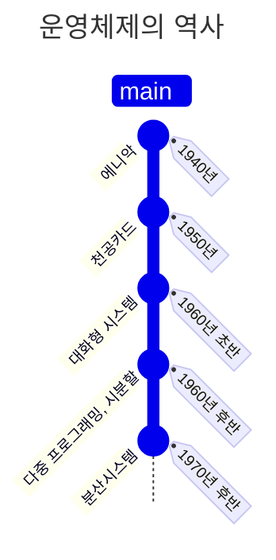

## 개요

우리가 흔히 알고있는 마이크로소프트의 `윈도우`와 `맥 OS(Mac OS)`, `리눅스` 그리고 `IOS`, `안드로이드`가 바로 대표적인 **운영체제**이다.

운영체제는 어쩌다 만들어졌을까?

운영체제가 정확히 무엇이고 왜 필요할까?

운영체제는 어떻게 구성되었을까?

다음 의문들을 정리하고자한다.

---

## 운영체제의 역사

먼저 운영체제가 만들어진 과거를 살펴보자.

### 1940년대

역사의 흐름은 1940년 부터 시작된다.

진공관이라는 소자를 이용하여, 일종의 스위치 개념으로 켜지면 1, 꺼지면 0이라 판단하였다.

전선을 연결하여 논리회로를 구성하는 ‘하드와이어링’ 방식으로 동작했다.

### 1950년대

이후 1950년대에 들어서는 논리적으로 순차 처리하는 **일괄 작업 시스템**으로 발전했다.

천공카드 시스템을 도입하여, 프로그램을 구성한 후 카드에 구멍을 뚫어 컴퓨터에 입력하면 프로그램이 실행되는 방식이다.

{: width="500" height="300" }
_천공 카드_

또한, 라인프린터를 이용하여 출력을 수행하였다.

메인 메모리가 운영체제 영역과 사용자 영역으로 나뉘었기에, 이때부터 운영체제가 도입되었다고 볼 수 있다.

### 1960년대 초반

주변 기기들(모니터, 키보드 등)이 생겨나면서 입력 값에 따라 작업의 흐름이 바뀌는 **대화형 시스템**을이 등장하게 되었다.

이를 통해, 문서 편집기, 게임 등과 같은 응용 프로그램 개발이 가능해졌다.

### 1960년대 후반

여러 작업을 시간을 분할하는 방법을 이용하여 동시에 처리하는 것 처럼 보이는 **시분할 시스템**까지 발전하게 되었다. 시분할 시스템의 아이디어는 1960년에 시연되었지만, 구축이 어렵고 비쌌기 때문에 1970년대 초까지 보편화되지 못했다고 한다.

잘게 나뉜 시간 한 조각을 `타임 슬라이스` 또는 `타임 퀀텀` 이라고 한다.

{: width="500" height="300" }
_시분할 시스템 구조_

이와 함께 다중 프로그래밍이라는 개념도 생겨났다.

다중 프로그래밍이란, CPU 작업과 입출력 작업을 병행하는 것을 말한다.

시분할 시스템을 이용하게 되면, 사용자는 마치 자신이 컴퓨터를 독점하여 원하는 대로 사용하는 듯한 착각을 가지게 된다.

또한, 짧은 시간 단위로 프로세스가 스위칭 되기 때문에, 대화식 처리에 유리하다는 장점이 있다.

때문에, 오늘날의 대부분의 시스템은 시분할 시스템을 이용하고 있다.

### 1970년 후반

인터넷이 보급됨에 따라 **분산 시스템**이 생겨났다.

개인용 컴퓨터와 인터넷이 보급되면서, 작은 컴퓨터를 하나로 묶어 대형 컴퓨터의 성능을 내도록 하는 시스템을 만들 수 있었다.

이를 네트워크 상에 분산 되어 있는 여러 컴퓨터로 작업을 할당하여 각각 개별적으로 처리하도록 하는 방식이다.

### 1990년 이후

분산 시스템을 만들어낸 이후, 이는 곧 **서버-클라이언트 시스템**으로 발전했다.

서버의 부담을 줄이고자 P2P가 등장하였고,

필요한 기간만큼 사용하고 비용을 지불하는 컴퓨팅 환경을 얻기 위해 **그리드 컴퓨팅, 클라우드 컴퓨팅** 등이 뜨고 있다.

---

## 운영체제의 정의

이제 운영체제란 정확히 무엇인가에 대해 알아보고자 한다.

OS(Operating System)는  일종의 시스템 소프트웨어이다.

앞서 역사를 살펴 보았을 때, 진공판, 일괄처리, 대화형, 시분할, 분산 시스템 등과 같은 발전 과정이 있었다. 이때, 운영체제가 생겨난 시점은 일괄처리 작업이 생겨난 시점이다.

왜 생겨났을까?

일괄처리 작업에서 우리는 입력 이후, 출력이 발생할 때 까지 별도의 작업을 할 수 없었다.

때문에 처음 작성한 프로그램이 컴퓨터를 보다 효율적으로 사용해야 할 필요가 있었다.

그로 인해, 간단한 작업 스케줄링과 자원 관리를 담당하는 소프트웨어가 필요했다.

바로 이것이 운영체제의 시작이다.

즉 **운영체제**는, 응용 프로그램이나 사용자에게 컴퓨터 자원을 사용할 수 있는 인터페이스를 제공하고 그 결과를 돌려주는 **시스템 소프트웨어**라고 할 수 있다.

---

## 운영체제의 역할

다음은 운영체제의 역할에 대해서 알아보고자 한다.

위의 내용을 정리하며 요구되는 기본 역할은 다음과 같다.

- **자원 관리 :** 하드웨어의 자원 관리 및 할당
- **메모리 관리 :** 컴퓨터의 메모리를 효율적으로 관리, 메모리 할당 및 해제, 가상메모리 관리
- **프로세스 관리 :** 실행중인 프로세스 관리, 프로세스 생성, 실행, 정지, 중지등을 제어
- **입출력 관리 :** 입출력 장치와의 상호작용
- **사용자 인터페이스 :** GUI / CLI

그 외도 다음과 같은 역할이 존재한다.

- **디스크 및 파일 시스템 관리 :** 파일의 생성, 삭제, 복사, 이동 등의 작업을 처리
- **네트워크 관리 :** 프로토콜을 지원, 컴퓨터 간의 통신을 가능케 하고 데이터 전송 및 보안을 관리
- **오류 처리 :** 시스템 내/외부에서 발생하는 오류와 예외를 처리. 비정상 종료, 메모리 오버플로우, 입출력 오류등을 처리
- **시스템 보안:** 접근 제어, 사용자 인증, 암호화

---

## 운영체제의 구조

_운영체제의 구조_
운영체제는 커널, 인터페이스, 시스템 콜, 드라이버 총 4가지 구성요소로 이루어져있다.

### 커널(Kernel)

첫번째로 가장 중요한 것은 커널이다. 커널은 용어 자체도 '핵심의' 같은 의미이다.
다음과 같은 핵심 역할이 있다.

- 프로세스 관리
  - 프로세스에 CPU를 배분하고 작업에 필요한 환경 제공
- 메모리 관리
  - 프로세스에 작업 공간을 배치하고 실제 메모리 공간보다 큰 가상 메모리 공간을 제공
- 파일 시스템 관리
  - 데이터를 저장/접근할 수 있는 인터페이스 제공
- 입출력 관리
- 프로세스간 통신 관리

### 인터페이스(Interface)

인터페이스는 사용자의 명령을 컴퓨터에 전달하고 결과를 사용자에게 알려주는 역할을 한다.
대표적으로 다음 2가지 종류가 있다.

- GUI(Graphical User Interface)
- CLI(Command Line Interface)

### 시스템 콜(System Call)

커널이 자신을 보호하기 위해 만든 인터페이스이다.
여기서 표현하는 인터페이스의 경우, 위의 인터페이스와 달리 객체지향에서 말하는 인터페이스와 유사한 표현이라고 생각한다.

시스템 콜은 사용자나 프로그램이 직접적으로 컴퓨터 자원에 접근하는 것을 막고 커널을 보호하기 위해서 만든 코드 집합이다.

시스템 콜 함수를 통해 커널에 접근할 수 있다.
아무나 접근하여 보거나 수정할 수 있게 만들면 안되기 때문에 운영체제는 시스템 콜을 통해서만 호출할 수 있게 디자인 되어있다.
즉, 캡슐화가 되어있는 형태이다.

### 드라이버(Driver)

주로, 커널과 하드웨어 인터페이스를 담당한다.
드라이버는 프린터, 키보드 및 디스크 드라이브와 같은 하드웨어 장치와 운영체제 간의 통신을 가능하게 하는 소프트웨어이다.
현재에도 프린터의 경우, 직접 드라이버를 설치하여 네트워크 프린터를 잡는 것을 생각하면 이해할 수 있다.

특수한 목적으로 만들어진 하드웨어의 경우, 모든 명령을 하달하는 것보다 그 하드웨어에 맞게 제공되는 인터페이스를 드라이버를 통해 호출하도록 하는 것이다.

---

## 마치며

운영체제의 역사를 전반적으로 살펴보았고, 컴퓨터를 보다 효율적으로 사용하기 위해 도입된 소프트웨어라고 하였다.

또한, 응용 프로그램이나 사용자에게 컴퓨터 자원을 사용할 수 있는 인터페이스를 제공하고 그 결과를 돌려주는 **시스템 소프트웨어**라고 하였다.

또, 운영체제는 커널, 인터페이스, 시스템 콜, 드라이버 등으로 구성되었다.
이때, 캡슐화의 원리가 매우 자연스럽게 녹아들어있었다.

또한, 운영체제 역시 결국 사용자에게 하여금 원리나 구조등을 숨겨 자동으로 동작됨을 생각하면 캡슐화 되어있다는 생각을 하게 된다.

어떻게 보면 캡슐화는 필수 불가결하다.
실제로 운영체제를 통해 안정적이고, 효율적인 동작을 하기 위해서는 사용자 또는 응용프로그램이 직접 하드웨어에 접근하는 것을 막아야 한다.

때문에 **User Mode(CPU 명령어 사용을 제한)**와 **Kernel Mode(CPU 명령어를 사용해 하드웨어를 직접 제어)**로 분리해 사용하게 된다. 그리고 User Mode와 Kernel Mode 사이는 시스템 콜(System Call)을 통해서 전환된다.

다음 포스팅에서는 해당 내용을 다뤄보도록 하겠다.

---

## 참고자료

- [[운영체제]시분할 시스템(Time-sharing System)](https://velog.io/@lixxce/%EC%9A%B4%EC%98%81%EC%B2%B4%EC%A0%9C%EC%8B%9C%EB%B6%84%ED%95%A0-%EC%8B%9C%EC%8A%A4%ED%85%9CTime-sharing-System)
- [[운영체제] 운영체제(OS)란?](https://jerryjerryjerry.tistory.com/171)
- [운영체제(OS)란? 개념과 구조(커널, 시스템콜 등)](https://coduking.tistory.com/entry/%EC%9A%B4%EC%98%81%EC%B2%B4%EC%A0%9COS%EB%9E%80-%EA%B0%9C%EB%85%90%EA%B3%BC-%EA%B5%AC%EC%A1%B0%EC%BB%A4%EB%84%90-%EC%8B%9C%EC%8A%A4%ED%85%9C%EC%BD%9C-%EB%93%B1)
